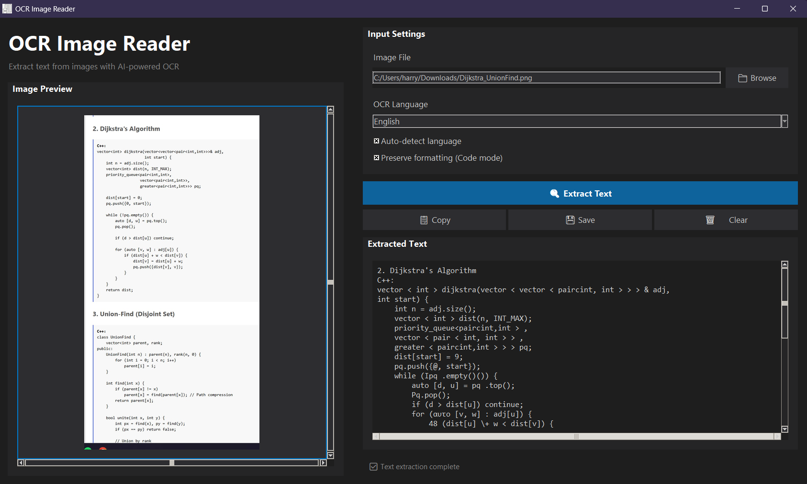

# OCR Image Reader 🖼️🔍

A sleek, modern desktop application for extracting text from images using **AI-powered OCR**. Perfect for scanning documents, screenshots, code snippets, or handwritten notes. Supports multiple languages and preserves formatting for code.  

## Features ✨

- Extract text from images (`PNG`, `JPEG`, `BMP`, `TIFF`, etc.)  
- Auto-detect language or select manually from 15+ languages  
- Preserve formatting for source code or structured text  
- Preprocess images for improved OCR accuracy  
- Post-process and clean code with auto-indentation for C++  
- Copy extracted text to clipboard or save as `.txt`  
- Modern dark-themed, responsive interface with image preview  

## Supported Languages 🌐

- English, Greek, Spanish, French, German, Italian, Portuguese  
- Russian, Chinese (Simplified & Traditional), Japanese, Korean  
- Arabic, Hindi  

## Screenshots 📸

  <!-- replace with your actual screenshot file -->

## Installation 💻

Download the latest **setup.exe** from the [Releases](https://github.com/yourusername/your-repo/releases) page and run the installer.  

No Python setup required—everything is bundled.  

## How to Use 📝

1. Launch the app  
2. Click **Browse** to select an image  
3. Choose the OCR language (or enable auto-detect)  
4. Optionally enable **Preserve formatting** for code  
5. Click **Extract Text**  
6. Copy or save your results  

## Requirements 🛠️

- Windows 10+ (64-bit recommended)  
- Built-in `setup.exe` includes all dependencies (Tesseract included if compiled with PyInstaller)  

For running from source:  

```bash
pip install -r requirements.txt

## Dependencies 🛠️

- Python 3.10+  
- Tkinter (usually included with Python)  
- Pillow  
- pytesseract  
- OpenCV (`cv2`)  
- NumPy  

> **Note:** If running from source, make sure [Tesseract OCR](https://github.com/tesseract-ocr/tesseract) is installed and added to your system PATH.


